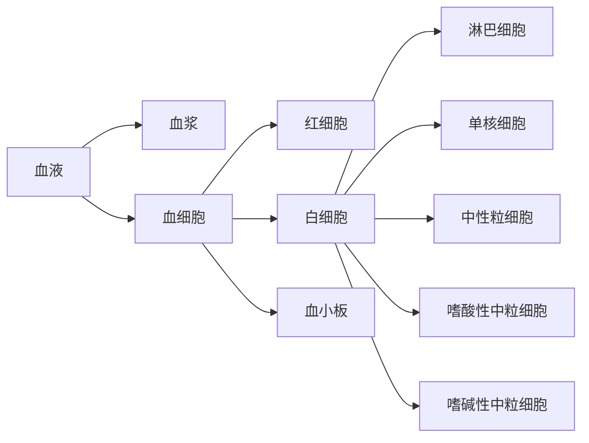

# 血液

!!! danger "警告"
    含有危险操作，除非紧急情况否则请勿在没有医疗人员在场的情况下使用

## 血液的组成

血液的组成主要包含三个部分，血浆于血细胞。血细胞由红细胞、白细胞、血小板组成[^1]

### 红细胞生理特征

1. 可塑变形性
2. 悬浮稳定性
3. 渗透脆性
   1. 红细胞在低渗盐溶液中发生膨胀破裂的特性称为红细胞渗透脆性，简称脆性

### 等渗溶液与等张溶液

等渗溶液是指与血浆渗透压相同的溶液[^2]（例如0.9%生理盐水），等张溶液是指，与红细胞张力相等的溶液。[^3]

## 血压

血压是指，血管内血液对血管单位面积造成的的侧压力，单位是毫米汞柱(mmHG)或千帕(kPa). 心脏由收缩期和舒张期，故血压也有收缩压(高压)与舒张压(低压)。当心脏收缩时，左心房的血液会泵入主动脉，这时产生的高压被称为收缩压。当血液流入右心房时产生的压力，称之为舒张压。[^4]

### 血压分类

|       定义       | 舒张压  | 收缩压  |
| :--------------: | :-----: | :-----: |
|      低血压      |   <90   |   <60   |
|     正常低值     |  90-99  |  60-64  |
|     正常血压     | 100-119 |  65-79  |
|     正常高值     | 120-139 |  80-89  |
|    一型高血压    | 140-159 |  90-99  |
|    二型高血压    | 160-179 | 100-109 |
|    三型高血压    |  >=180  |  >=110  |
| 单纯收缩期高血压 |  >=140  |   <90   |

[^5]

### 血压的影响因素

1. 身高：身高越高，心脏需要更大的压力泵出血液，令血液流遍全身
2. 血黏度：血液越粘稠，心脏越需要更大的压力泵出血液
3. 姿势：由于重力影响，平躺收缩压最高，其次为坐姿最后为站姿。舒张压则是相反
4. 血管横截面积：如果血管变窄，心脏则需要更大的压力将血液泵出
5. 其他：精神状态、药物、饮食等

## 凝血

凝血指的是血液由液体状态转变为不流动的凝胶状态的过程，是生理性止血的重要环节。参与凝血过程的物质统称为凝血因子，他的作用是在血管出血时被激活，与血小板粘连在一起补塞血管上的破损

## 出血

血液自心、血管腔外出，称为出血。出血分为内出血与外出血。内出血是指血液进入体腔或组织内部，外出血是指血液流出体外。**大出血时禁止饮水进食**

### 危害

急性大出血出血量达到全身血量的三分之一或更多，血压会急剧下降，可以导致出血性休克。慢性少量出血，可能会引起贫血。

## 急救

!!! danger "警告"
    直接接触血液是最危险的，建议佩戴橡胶手套进行急救。

!!! notes "忠告"
    你的目的不是帮助患者康复，而是帮助患者坚持到急救医生的到来。

!!! notes "忠告"
    你没有权利宣布患者的死亡，需要专业的医疗人员判断

### 分辨出血类型

[^6]

#### 内出血

内出血可以从两方面诊断。一是从咳血、呕血、尿血或便血诊断，判断是否有肺部、胃部、肾、膀胱、肠道是否有出血。二是从相应症状诊断，如面色苍白，出冷汗，四肢冷，胸、腹部肿胀疼痛等

#### 外出血

外出血分为动脉出血、静脉出血、毛细血管网出血

- 动脉出血: 血液鲜红色喷射状，出血量大，情况危急。不及时止血短时间内便会危及生命。常见于猛兽咬伤、严重切割伤。
- 静脉出血: 血液暗红色非喷射状流出，不及时止血，长时间也可危及生命。常见于切割伤。
- 毛细血管网出血：水滴状渗出，危险性最小。常见于擦伤。

### 内出血急救

尽早识别严重的内出血。受伤后，病人面色苍白、表情冷淡、少言寡语、呼吸变迁、烦躁不安、口渴，但身体上无伤口。

- 严禁饮水进食
- 向120急救电话呼救
- 在急救人员到来之前，密切看护病人，注意保持呼吸道通常

### 外出血急救

外出血一般可以使用**压迫止血法**、**抬高伤肢**、**止血带**、**填塞止血**

#### 压迫止血

可以直接以纱布或干净的布料(尽量不要使用卫生纸)覆盖伤口对其对其进行加压，加压是可以双手交叠(和心肺复苏一样)加压。

#### 抬高伤肢

主要是降低出血部位的血压而减少出血，适用于四肢毛细血管和小静脉出血，其他情况下一般和其他止血方法辅助出现。如果出现骨折现象，不得随意移动

#### 止血带

止血带主要是通过压迫血管，阻断血液流动来达到目的。一般适用于四肢出血，使用不当会导致远端肢体缺血坏死。一般情况下只有在出血猛烈，其他方法难以止血的情况下使用止血带。

止血带的使用方法：

1. 使用后，标记止血时间
2. 止血带使用1小时后，需要放松2-3分钟。如果出血量大则适当延长止血带放松间隔，总体不超过三分钟，避免出现远端肢体难以存活情况。

止血带的位置

1. 现场危险，高又紧
2. 现场相对安全可控，充分暴露伤口后，伤口上方5-6cm

##### 止血降级

止血降级取决于操作者能力、伤口深浅、出血状况、现场环境是否相对安全可控。如果伤口浅，出血量少，操作者能力过硬，环境相对安全可以降级为加压止血。反之则不建议降级。

#### 填塞止血

**填塞止血相对困难，对于操作者要求高，不建议使用。**

操作者先以戴手套的手指深入伤口内探找或肉眼可见找寻实际且确切的出血血管位置，再以沾有止血药药的纱布或一般纱布，完全填塞于深度伤口内(止血的管位置)填满后，再由外部加压止血的止血法。

[^1]: [血细胞](https://www.yixue.com/%E8%A1%80%E7%BB%86%E8%83%9E)
[^2]: [等渗溶液](https://www.yixue.com/%E7%AD%89%E6%B8%97%E6%BA%B6%E6%B6%B2)
[^3]: [等张溶液](https://www.yixue.com/%E7%AD%89%E5%BC%A0%E6%BA%B6%E6%B6%B2)
[^4]: [血压](https://www.yixue.com/%E7%94%9F%E7%90%86%E5%AD%A6/%E8%A1%80%E5%8E%8B)
[^5]: [卫健委成人高血压食养指南（2023 年版）附录5](http://www.nhc.gov.cn/sps/s7887k/202301/0e55a01df50c47d9a4a43db026e3afc3/files/63f752a17cfd4b4781f744477561866f.pdf)
[^6]: [出血分类](https://www.yixue.com/%E6%AD%A2%E8%A1%80#%E5%A4%96%E4%BC%A4%E5%87%BA%E8%A1%80%E5%88%86%E7%B1%BB)